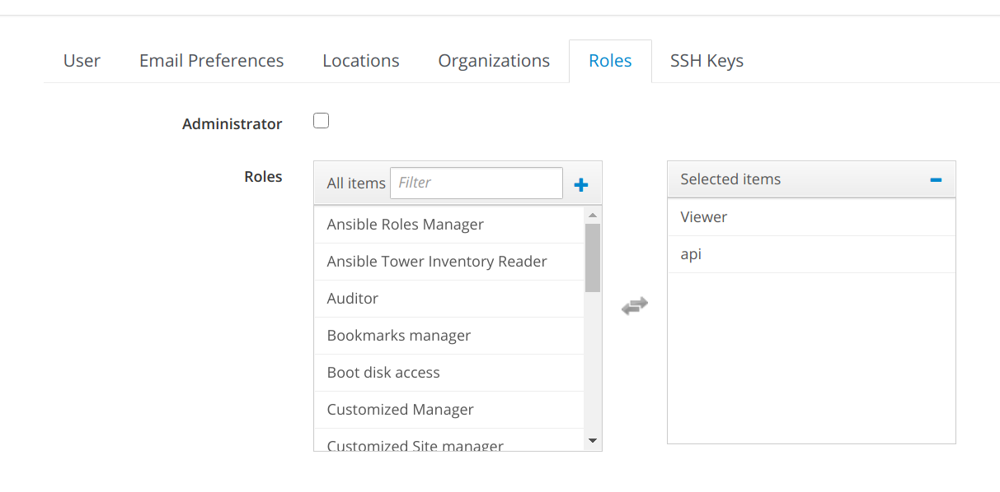

# Foreman Exporter for Prometheus

[](https://lgtm.com/projects/g/marcinbojko/foreman_exporter/alerts/)
[](https://github.com/marcinbojko/foreman_exporter/actions/workflows/01_lint_me.yml)

<!-- TOC -->

- [Foreman Exporter for Prometheus](#foreman-exporter-for-prometheus)
  - [What is it](#what-is-it)
    - [Metrics](#metrics)
    - [Foreman presented fields and labels](#foreman-presented-fields-and-labels)
    - [Tested with](#tested-with)
  - [Usage](#usage)
    - [Foreman configuration](#foreman-configuration)
      - [In Foreman, create a role first](#in-foreman-create-a-role-first)
      - [The assign it to an user](#the-assign-it-to-an-user)
    - [Configuration](#configuration)
    - [Docker-compose example](#docker-compose-example)
    - [Prometheus scrape example](#prometheus-scrape-example)
  - [Kubernetes example](#kubernetes-example)
  - [Kubertenes with Service Monitor example](#kubertenes-with-service-monitor-example)
  - [To DO](#to-do)
  - [About](#about)

<!-- /TOC -->

## What is it

Foreman exporter is a small Python3 script exposing host metrics from The Foreman [https://www.theforeman.org/](https://www.theforeman.org/). It uses API to get as much needed information about hosts statuses wrapping these in labels provided by The Foreman itself.
It can be used as a stats tool for configuration applying status, hosts status, and potential errors

### Metrics

- `foreman_exporter_hosts` - Gauge - returns host list with their statuses
- `foreman_exporter_hosts_request_time_seconds` - Gauge - returns time needed to do a  `/api/hosts` query
- `foreman_exporter_hosts_count` - Gauge - total number of hosts returned by query
- `foreman_exporter_dashboard_total_hosts` - Gauge - "Total hosts count"
- `foreman_exporter_dashboard_bad_hosts` - Gauge - "Hosts with error state"
- `foreman_exporter_dashboard_bad_hosts_enabled` - Gauge - "Hosts with error state and alerts enabled"
- `foreman_exporter_dashboard_active_hosts` - Gauge - "Hosts which recently applied changes"
- `foreman_exporter_dashboard_active_hosts_ok` - Gauge - "Hosts which recently applied changes successfully"
- `foreman_exporter_dashboard_active_hosts_ok_enabled` - Gauge - "Hosts which recently applied changes successfully with alerts enabled"
- `foreman_exporter_dashboard_ok_hosts` - Gauge - "Hosts without changes or errors"
- `foreman_exporter_dashboard_ok_hosts_enabled` - Gauge - "Hosts without changes or errors, with alerts enabled"
- `foreman_exporter_dashboard_disabled_hosts` - Gauge - "Hosts with alerts disabled"
- `foreman_exporter_dashboard_pending_hosts` - Gauge - "Hosts that had pending changes"
- `foreman_exporter_dashboard_pending_hosts_enabled` - Gauge - "Hosts that had pending changes with alerts enabled"
- `foreman_exporter_dashboard_out_of_sync_hosts` - Gauge - "Out of sync hosts"
- `foreman_exporter_dashboard_out_of_sync_hosts_enabled` - Gauge - "Out of sync hosts with alerts enabled"
- `foreman_exporter_dashboard_good_hosts` - Gauge - "Hosts without errors"
- `foreman_exporter_dashboard_good_hosts_enabled` - Gauge - "Hosts without errors, with alerts enabled"
- `foreman_exporter_dashboard_percentage` - Gauge - "Hosts without errors percent"
- `foreman_exporter_dashboard_reports_missing` - Gauge - "Hosts which are not reporting"
- `foreman_exporter_dashboard_request_time_seconds` - Gauge - returns time needed to do a `/api/dashboards` query

### Foreman presented fields and labels

|foreman api field|prometheus label|
|-----------------|----------------|
|name|hostname|
|domain_name|domain|
|global_status_label|global_label|
|configuration_status|configuration_status|
|configuration_status_label|configuration_status_label|
|puppet_status|puppet_status|
|environment_name|puppet_environment|
|operatingsystem_name|operatingsystem|
|-|hostname|

### Tested with

- Foreman 1.22.x

- Foreman 1.23.x

## Usage

### Foreman configuration

To use access to API you need an user with at least 'viewer' role for hosts and `access dashboard` role to read dashboards statuses.

#### In Foreman, create a role first


#### The assign it to an user



### Configuration

Create a set of environment variables. All variables are required.

```ini
FOREMAN_REQUEST_URI=https://foreman.home.lan
FOREMAN_REQUEST_USER=api
FOREMAN_REQUEST_PASSWORD=api
FOREMAN_REQUEST_TLS_VERIFY=false
FOREMAN_REQUEST_TIMEOUT=60
FOREMAN_REQUEST_INTERVAL=120
```

### Docker-compose example

```yaml
version: "3.8"
services:
  foreman_exporter:
    image: marcinbojko/foreman_exporter:latest
    ports:
     - "8000:8000"
    env_file:
      ./foreman_exporter.env
```

### Prometheus scrape example

```yaml
- job_name: 'foreman_exporter'
  scrape_interval: 120s
  honor_labels: true
  metrics_path: '/'
  scheme: http
  static_configs:
    - targets:
      - 'foreman_exporter:8000'
      labels:
        app: "foreman-exporter"
        env: "int"
        team: "it"
```

## Kubernetes example

Working example is available as `./foreman-exporter.yaml`

To use:

- Change ENV Variables in config section of a file:

  ```yaml
  ---
  apiVersion: v1
  kind: ConfigMap
  metadata:
    name: foreman-exporter-env-config
  data:
    FOREMAN_REQUEST_INTERVAL: "120"
    FOREMAN_REQUEST_TIMEOUT: "60"
    FOREMAN_REQUEST_TLS_VERIFY: "false"
    FOREMAN_REQUEST_URI: https://foreman.sample.com
    FOREMAN_REQUEST_USER: api
  ---
  ```

- Generate new secret for `FOREMAN_REQUEST_PASSWORD`

  ```bash
  echo -n newpassword|base64
  ```

  ```yaml
  apiVersion: v1
  kind: Secret
  metadata:
    name: foreman-exporter-env-secret
  data:
    FOREMAN_REQUEST_PASSWORD: base64-password-here-from-above
  ---
  ```

- Change ingress name or/and add tls section

  ```yaml
  ---
   apiVersion: extensions/v1beta1
   kind: Ingress
   metadata:
     name: foreman-exporter-ingress
     labels:
         name: foreman-exporter
   spec:
     rules:
     - host: foreman-exporter.sample.com
       http:
         paths:
         - pathType: Prefix
           path: "/"
           backend:
             serviceName: foreman-exporter-service
             servicePort: 8000
   ```

- Run

  ```bash
  kubectl apply -f foreman-exporter.yaml
  ```

## Kubertenes with Service Monitor example

If you'd like to expose your metrics to Prometheus Operator:

`./k8s/foreman-exporter-custom-metrics.yaml`

## To DO

- replace prometheus http server with `Flask`
- change path to /metrics
- add more API checks (facts maybe?)
- ~~Kubernetes setup~~
- switch to `urllib3` instead of `requests`
- improve python skills

## About

That's a small side-project for me to learn Python3
